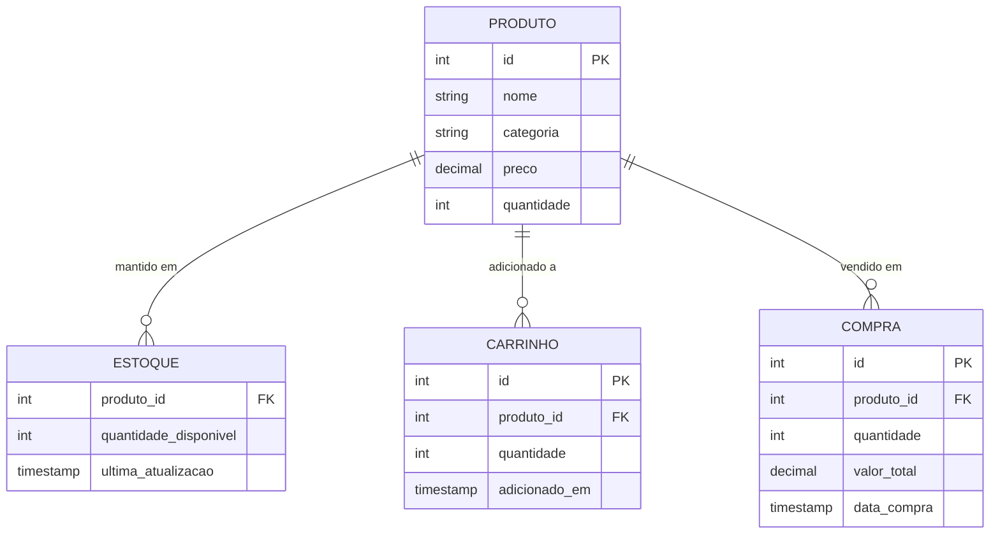

# Supermarket Manager - Sistema de Gerenciamento de Estoque e Carrinho

[](https://www.oracle.com/java/)
[](https://www.mysql.com/)
[](https://docs.oracle.com/javase/tutorial/jdbc/)
[](https://picocli.info/)
[](https://maven.apache.org/)

Sistema completo de gerenciamento de supermercado com interface CLI e console interativo. Controle de estoque, carrinho de compras e checkout com persistência MySQL, oferecendo duas interfaces: menu interativo tradicional e comandos CLI modernos com Picocli.

---

## Quick Start

```bash
# 1. Clonar o repositório
git clone https://github.com/your-username/retail-sys-api.git
cd retail-sys-api

# 2. Configurar MySQL
mysql -u root -p < src/main/resources/script.txt

# 3. Configurar db.properties
# Editar src/main/resources/db.properties com suas credenciais

# 4. Compilar o projeto
mvn clean package

# 5. Executar a aplicação

# Opção A: Menu interativo
java -cp target/retail-sys-api-1.0.0.jar carrinho.Program

# Opção B: Interface CLI
java -cp target/retail-sys-api-1.0.0.jar carrinho.cli.SupermarketCLI estoque -l
```

---

## Funcionalidades

### Gerenciamento de Estoque
- Adicionar produtos ao inventário
- Remover produtos do inventário
- Buscar produtos por ID
- Listar todos os produtos disponíveis
- Categorização de produtos
- Controle de quantidade e preços

### Gerenciamento de Carrinho
- Adicionar produtos ao carrinho
- Remover produtos do carrinho
- Visualizar conteúdo do carrinho
- Limpar carrinho completamente
- Calcular valor total

### Sistema de Checkout
- Processar compra e atualizar estoque
- Validação de disponibilidade
- Atualização automática do inventário
- Limpeza do carrinho após checkout

### Múltiplas Interfaces
- Menu interativo tradicional (console)
- CLI moderna com Picocli (comandos)
- Persistência em MySQL
- Operações JDBC otimizadas

---

## Arquitetura

### Arquitetura do Sistema


### Modelo de Dados (Diagrama ER)


---

## Tecnologias

### Core

| Tecnologia | Versão | Propósito |
|------------|--------|-----------|
| Java | 17 | Linguagem de programação |
| Maven | 3.9 | Build e gerenciamento de dependências |
| MySQL | 8.0 | Banco de dados relacional |
| JDBC | - | Conectividade com banco de dados |

### Bibliotecas

| Biblioteca | Versão | Propósito |
|------------|--------|-----------|
| Picocli | 4.7.x | Framework para comandos CLI |
| MySQL Connector/J | 8.0.x | Driver JDBC para MySQL |

### Ferramentas

| Ferramenta | Propósito |
|------------|-----------|
| IntelliJ IDEA | IDE recomendada |
| MySQL Workbench | Gerenciamento visual do BD |
| Maven | Automação de build |


---

## Uso

### Modo 1: Menu Interativo

Executar o programa com interface de menu tradicional:

```bash
java -cp target/retail-sys-api-1.0.0.jar carrinho.Program
```

**Interface:**
```
=== SUPERMARKET MANAGER ===
1. Gerenciar Estoque
2. Gerenciar Carrinho
3. Fazer Checkout
0. Sair
Escolha uma opção: _
```

#### Menu de Estoque

```
=== ESTOQUE ===
1. Adicionar produto
2. Remover produto
3. Listar produtos
4. Buscar produto por ID
0. Voltar
Escolha uma opção: 1

Digite o nome do produto: Café 500g
Digite a categoria: Alimentos
Digite o preço: 18.90
Digite a quantidade: 50

Produto adicionado com sucesso! ID: 9
```

#### Menu de Carrinho

```
=== CARRINHO ===
1. Adicionar produto ao carrinho
2. Remover produto do carrinho
3. Ver carrinho
4. Limpar carrinho
0. Voltar
Escolha uma opção: 1

Digite o ID do produto: 1
Digite a quantidade: 2

2x Arroz 5kg adicionados ao carrinho
```

#### Checkout

```
=== CHECKOUT ===
Itens no carrinho:
1. Arroz 5kg - Qtd: 2 - R$ 51.80
2. Feijão 1kg - Qtd: 3 - R$ 25.50

Total: R$ 77.30

Confirmar compra? (S/N): S

Compra realizada com sucesso!
Estoque atualizado
Carrinho limpo
```

---

## Interface CLI

### Comandos Disponíveis

Executar comandos diretos usando a interface CLI moderna:

```bash
java -cp target/retail-sys-api-1.0.0.jar carrinho.cli.SupermarketCLI [COMANDO] [OPÇÕES]
```

### Ajuda Geral

```bash
java -cp target/retail-sys-api-1.0.0.jar carrinho.cli.SupermarketCLI --help
```

**Saída:**
```
Usage: supermarket-cli [COMMAND]
Sistema de Gerenciamento de Supermercado - Interface CLI

Comandos:
  estoque   Gerenciar estoque de produtos
  carrinho  Gerenciar carrinho de compras
  help      Exibir informações de ajuda
```

---

### Comando: estoque

#### Listar produtos

```bash
java -cp target/retail-sys-api-1.0.0.jar carrinho.cli.SupermarketCLI estoque -l
```

**Saída:**
```
=== ESTOQUE ===
ID  | Nome              | Categoria  | Preço   | Quantidade
----|-------------------|------------|---------|------------
1   | Arroz 5kg         | Alimentos  | R$ 25.90| 100
2   | Feijão 1kg        | Alimentos  | R$ 8.50 | 150
3   | Óleo de Soja 900ml| Alimentos  | R$ 7.20 | 80
...
```

#### Adicionar produto

```bash
java -cp target/retail-sys-api-1.0.0.jar carrinho.cli.SupermarketCLI estoque \
  -a \
  --name "Café 500g" \
  --category "Alimentos" \
  --price 18.90 \
  --quantity 50
```

#### Remover produto

```bash
java -cp target/retail-sys-api-1.0.0.jar carrinho.cli.SupermarketCLI estoque \
  -r \
  --id 9 \
  --quantity 10
```

#### Buscar produto por ID

```bash
java -cp target/retail-sys-api-1.0.0.jar carrinho.cli.SupermarketCLI estoque \
  --find 1
```

---

### Comando: carrinho

#### Listar itens do carrinho

```bash
java -cp target/retail-sys-api-1.0.0.jar carrinho.cli.SupermarketCLI carrinho -l
```

#### Adicionar ao carrinho

```bash
java -cp target/retail-sys-api-1.0.0.jar carrinho.cli.SupermarketCLI carrinho \
  -a \
  --product-id 1 \
  --quantity 2
```

#### Remover do carrinho

```bash
java -cp target/retail-sys-api-1.0.0.jar carrinho.cli.SupermarketCLI carrinho \
  -r \
  --product-id 1
```

#### Limpar carrinho

```bash
java -cp target/retail-sys-api-1.0.0.jar carrinho.cli.SupermarketCLI carrinho --clear
```

---

### Tabela Completa de Comandos CLI

| Comando | Opções | Descrição | Exemplo |
|---------|--------|-----------|---------|
| `estoque -l` | `--list` | Listar todos os produtos | `estoque -l` |
| `estoque -a` | `--add`, `--name`, `--category`, `--price`, `--quantity` | Adicionar produto | `estoque -a --name "Café" --price 18.90 --quantity 50` |
| `estoque -r` | `--remove`, `--id`, `--quantity` | Remover quantidade | `estoque -r --id 1 --quantity 10` |
| `estoque --find` | `--find <id>` | Buscar por ID | `estoque --find 1` |
| `carrinho -l` | `--list` | Listar carrinho | `carrinho -l` |
| `carrinho -a` | `--add`, `--product-id`, `--quantity` | Adicionar ao carrinho | `carrinho -a --product-id 1 --quantity 2` |
| `carrinho -r` | `--remove`, `--product-id` | Remover do carrinho | `carrinho -r --product-id 1` |
| `carrinho --clear` | `--clear` | Limpar carrinho | `carrinho --clear` |
| `help` | - | Ajuda | `help` |

---

## Estrutura de Classes

### Organização do Projeto

```
retail-sys-api/
├── src/
│   └── main/
│       ├── java/
│       │   └── carrinho/
│       │       ├── Program.java              # Main - Menu interativo
│       │       ├── Menu.java                 # Gerenciador de menus
│       │       ├── servico/
│       │       │   ├── Estoque.java         # Lógica de estoque
│       │       │   └── Carrinho.java        # Lógica de carrinho
│       │       ├── entidades/
│       │       │   └── Produto.java         # Entidade Produto
│       │       ├── db/
│       │       │   ├── DB.java              # Conexão com BD
│       │       │   └── DbException.java     # Exceções customizadas
│       │       └── cli/
│       │           └── SupermarketCLI.java  # Interface CLI (Picocli)
│       └── resources/
│           ├── db.properties                 # Configurações do BD
│           ├── script.txt                    # Script SQL inicial
│           └── mysql-connector/              # Driver JDBC
└── pom.xml                                   # Maven config
```
