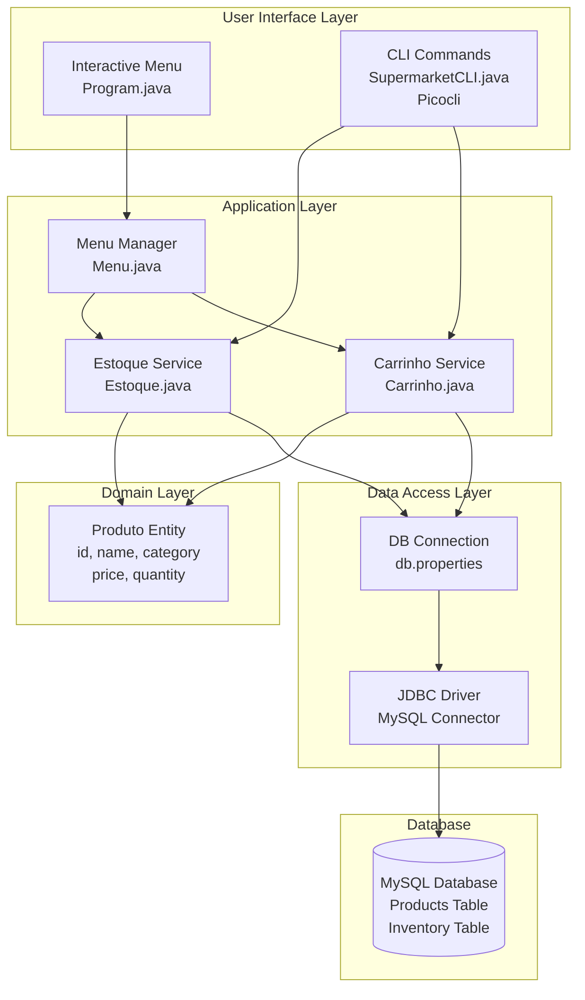

# Supermarket Manager - Inventory and Cart Management System

[](https://www.oracle.com/java/)
[](https://www.mysql.com/)
[](https://docs.oracle.com/javase/tutorial/jdbc/)
[](https://picocli.info/)
[](https://maven.apache.org/)

Complete supermarket management system with CLI and interactive console interface. Inventory control, shopping cart, and checkout with MySQL persistence, offering two interfaces: traditional interactive menu and modern CLI commands with Picocli.

---

## Quick Start

```bash
# 1. Clone the repository
git clone https://github.com/your-username/retail-sys-api.git
cd retail-sys-api

# 2. Configure MySQL
mysql -u root -p < src/main/resources/script.txt

# 3. Configure db.properties
# Edit src/main/resources/db.properties with your credentials

# 4. Compile the project
mvn clean package

# 5. Run the application

# Option A: Interactive menu
java -cp target/retail-sys-api-1.0.0.jar carrinho.Program

# Option B: CLI interface
java -cp target/retail-sys-api-1.0.0.jar carrinho.cli.SupermarketCLI estoque -l
```

---

## Features

### Inventory Management
- Add products to inventory
- Remove products from inventory
- Search products by ID
- List all available products
- Product categorization
- Quantity and price control

### Cart Management
- Add products to cart
- Remove products from cart
- View cart contents
- Clear cart completely
- Calculate total value

### Checkout System
- Process purchase and update inventory
- Availability validation
- Automatic inventory update
- Cart cleanup after checkout

### Multiple Interfaces
- Traditional interactive menu (console)
- Modern CLI with Picocli (commands)
- MySQL persistence
- Optimized JDBC operations

---

## Architecture

### System Architecture



### Data Model (ER Diagram)


---

## Technologies

### Core

| Technology | Version | Purpose |
|------------|---------|---------|
| Java | 17 | Programming language |
| Maven | 3.9 | Build and dependency management |
| MySQL | 8.0 | Relational database |
| JDBC | - | Database connectivity |

### Libraries

| Library | Version | Purpose |
|---------|---------|---------|
| Picocli | 4.7.x | CLI commands framework |
| MySQL Connector/J | 8.0.x | MySQL JDBC driver |

### Tools

| Tool | Purpose |
|------|---------|
| IntelliJ IDEA | Recommended IDE |
| MySQL Workbench | Visual database management |
| Maven | Build automation |


---

## Usage

### Mode 1: Interactive Menu

Run program with traditional menu interface:

```bash
java -cp target/retail-sys-api-1.0.0.jar carrinho.Program
```

**Interface:**
```
=== SUPERMARKET MANAGER ===
1. Manage Inventory
2. Manage Cart
3. Checkout
0. Exit
Choose option: _
```

#### Inventory Menu

```
=== INVENTORY ===
1. Add product
2. Remove product
3. List products
4. Search product by ID
0. Back
Choose option: 1

Enter product name: Coffee 500g
Enter category: Food
Enter price: 18.90
Enter quantity: 50

Product successfully added! ID: 9
```

#### Cart Menu

```
=== CART ===
1. Add product to cart
2. Remove product from cart
3. View cart
4. Clear cart
0. Back
Choose option: 1

Enter product ID: 1
Enter quantity: 2

2x Rice 5kg added to cart
```

#### Checkout

```
=== CHECKOUT ===
Cart items:
1. Rice 5kg - Qty: 2 - R$ 51.80
2. Beans 1kg - Qty: 3 - R$ 25.50

Total: R$ 77.30

Confirm purchase? (Y/N): Y

Purchase completed successfully!
Inventory updated
Cart cleared
```

---

## CLI Interface

### Available Commands

Execute direct commands using modern CLI interface:

```bash
java -cp target/retail-sys-api-1.0.0.jar carrinho.cli.SupermarketCLI [COMMAND] [OPTIONS]
```

### General Help

```bash
java -cp target/retail-sys-api-1.0.0.jar carrinho.cli.SupermarketCLI --help
```

**Output:**
```
Usage: supermarket-cli [COMMAND]
Supermarket Management System - CLI Interface

Commands:
  estoque   Manage product inventory
  carrinho  Manage shopping cart
  help      Display help information
```

---

### Command: estoque

#### List products

```bash
java -cp target/retail-sys-api-1.0.0.jar carrinho.cli.SupermarketCLI estoque -l
```

**Output:**
```
=== INVENTORY ===
ID  | Name              | Category  | Price   | Quantity
----|-------------------|-----------|---------|------------
1   | Rice 5kg          | Food      | R$ 25.90| 100
2   | Beans 1kg         | Food      | R$ 8.50 | 150
3   | Soybean Oil 900ml | Food      | R$ 7.20 | 80
...
```

#### Add product

```bash
java -cp target/retail-sys-api-1.0.0.jar carrinho.cli.SupermarketCLI estoque \
  -a \
  --name "Coffee 500g" \
  --category "Food" \
  --price 18.90 \
  --quantity 50
```

**Output:**
```
Product successfully added!
  ID: 9
  Name: Coffee 500g
  Category: Food
  Price: R$ 18.90
  Quantity: 50
```

#### Remove product

```bash
java -cp target/retail-sys-api-1.0.0.jar carrinho.cli.SupermarketCLI estoque \
  -r \
  --id 9 \
  --quantity 10
```

**Output:**
```
10 units of 'Coffee 500g' removed from inventory
  Remaining quantity: 40
```

#### Search product by ID

```bash
java -cp target/retail-sys-api-1.0.0.jar carrinho.cli.SupermarketCLI estoque \
  --find 1
```

**Output:**
```
=== PRODUCT ===
ID: 1
Name: Rice 5kg
Category: Food
Price: R$ 25.90
Stock quantity: 100
```

---

### Command: carrinho

#### List cart items

```bash
java -cp target/retail-sys-api-1.0.0.jar carrinho.cli.SupermarketCLI carrinho -l
```

**Output:**
```
=== SHOPPING CART ===
ID  | Product           | Qty | Unit Price  | Subtotal
----|-------------------|-----|-------------|----------
1   | Rice 5kg          | 2   | R$ 25.90    | R$ 51.80
2   | Beans 1kg         | 3   | R$ 8.50     | R$ 25.50

Total: R$ 77.30
```

#### Add to cart

```bash
java -cp target/retail-sys-api-1.0.0.jar carrinho.cli.SupermarketCLI carrinho \
  -a \
  --product-id 1 \
  --quantity 2
```

**Output:**
```
2x Rice 5kg added to cart
  Unit price: R$ 25.90
  Subtotal: R$ 51.80
```

#### Remove from cart

```bash
java -cp target/retail-sys-api-1.0.0.jar carrinho.cli.SupermarketCLI carrinho \
  -r \
  --product-id 1
```

**Output:**
```
Rice 5kg removed from cart
```

#### Clear cart

```bash
java -cp target/retail-sys-api-1.0.0.jar carrinho.cli.SupermarketCLI carrinho --clear
```

**Output:**
```
Cart successfully cleared
```

---

### Complete CLI Commands Table

| Command | Options | Description | Example |
|---------|---------|-------------|---------|
| `estoque -l` | `--list` | List all products | `estoque -l` |
| `estoque -a` | `--add`, `--name`, `--category`, `--price`, `--quantity` | Add product | `estoque -a --name "Coffee" --price 18.90 --quantity 50` |
| `estoque -r` | `--remove`, `--id`, `--quantity` | Remove quantity | `estoque -r --id 1 --quantity 10` |
| `estoque --find` | `--find <id>` | Search by ID | `estoque --find 1` |
| `carrinho -l` | `--list` | List cart | `carrinho -l` |
| `carrinho -a` | `--add`, `--product-id`, `--quantity` | Add to cart | `carrinho -a --product-id 1 --quantity 2` |
| `carrinho -r` | `--remove`, `--product-id` | Remove from cart | `carrinho -r --product-id 1` |
| `carrinho --clear` | `--clear` | Clear cart | `carrinho --clear` |
| `help` | - | Help | `help` |

---

## Class Structure

### Project Organization

```
retail-sys-api/
├── src/
│   └── main/
│       ├── java/
│       │   └── carrinho/
│       │       ├── Program.java              # Main - Interactive menu
│       │       ├── Menu.java                 # Menu manager
│       │       ├── servico/
│       │       │   ├── Estoque.java         # Inventory logic
│       │       │   └── Carrinho.java        # Cart logic
│       │       ├── entidades/
│       │       │   └── Produto.java         # Product entity
│       │       ├── db/
│       │       │   ├── DB.java              # Database connection
│       │       │   └── DbException.java     # Custom exceptions
│       │       └── cli/
│       │           └── SupermarketCLI.java  # CLI interface (Picocli)
│       └── resources/
│           ├── db.properties                 # Database config
│           ├── script.txt                    # Initial SQL script
│           └── mysql-connector/              # JDBC driver
└── pom.xml                                   # Maven config
```
